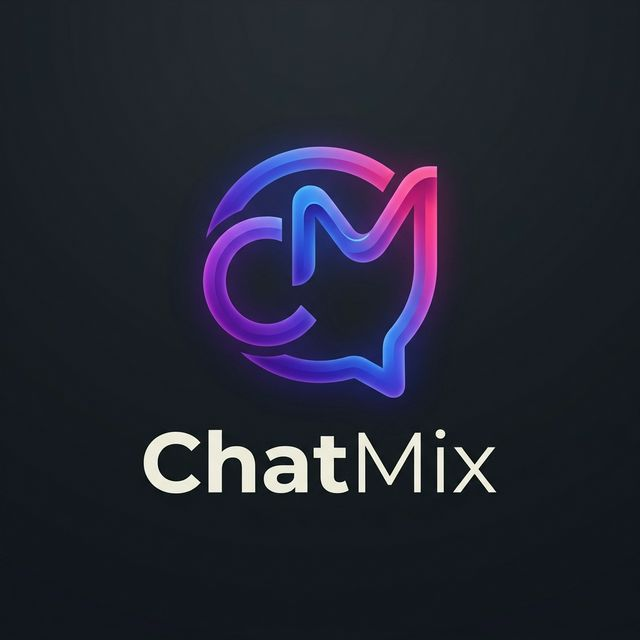

#  ChatMix

**ChatMix** is a premium, real-time messaging application designed with a sleek glassmorphism aesthetic. It offers a seamless communication experience with private messaging, group chats, and high-quality audio calling, all powered by Firebase and WebRTC.

---

## ✨ Features

### 💬 Real-time Communication
- **Instant Messaging**: Powered by Firebase Real-time Database for sub-second latency.
- **Group Chats**: Create and manage group conversations with multiple participants.
- **Direct Messaging**: Search for users by email and start private conversations.
- **Message Replies**: Interactively reply to specific messages to keep context lively.

### 📞 Advanced Connectivity
- **WebRTC Audio Calling**: Crystal-clear voice calls directly in the browser.
- **Typing Indicators**: See when your contacts are "writing something dope...".
- **Online/Offline Status**: Real-time status tracking for all users.

### 🎨 Premium User Experience
- **Glassmorphism Design**: A modern, transparent UI built with Tailwind CSS and custom animations.
- **Image Lightbox**: View shared images in a high-resolution, interactive zoomable gallery.
- **System Notifications**: Stay updated with browser-level notifications for new messages.
- **Responsive Layout**: Optimized for both mobile (dynamic height fix) and desktop environments.

### 🛡 Security & Auth
- **Secure Signup**: Email-link based authentication flow to ensure verified accounts.
- **Encrypted Messaging**: Design architecture ready for end-to-end encryption.
- **Session Management**: Secure cookie-based session handling with automatic timeouts.

---

## 🛠 Tech Stack

- **Frontend**: Vanilla JavaScript (ES6+), HTML5, CSS3
- **Styling**: [Tailwind CSS](https://tailwindcss.com/)
- **Backend**: [Firebase](https://firebase.google.com/) (Auth, Real-time Database)
- **Voice Engine**: [WebRTC](https://webrtc.org/) (for Audio Calling)
- **Typography**: Plus Jakarta Sans (Google Fonts)

---

## 🚀 Getting Started

### Prerequisites

You will need a Firebase project to run ChatMix.

1.  Create a project in the [Firebase Console](https://console.firebase.google.com/).
2.  Enable **Authentication** (Email/Password & Email Link).
3.  Create a **Real-time Database**.
4.  Copy your Firebase configuration.

### Setup

1.  Clone the repository:
    ```bash
    git clone https://github.com/your-username/chatmix.git
    cd chatmix
    ```

2.  Update the Firebase configuration in `index.html`:
    ```javascript
    const firebaseConfig = {
        apiKey: "YOUR_API_KEY",
        authDomain: "YOUR_AUTH_DOMAIN",
        databaseURL: "YOUR_DATABASE_URL",
        projectId: "YOUR_PROJECT_ID",
        storageBucket: "YOUR_STORAGE_BUCKET",
        messagingSenderId: "YOUR_SENDER_ID",
        appId: "YOUR_APP_ID"
    };
    ```

3.  Open `index.html` in your browser or serve it using a local server (like Live Server in VS Code).

---

## 📂 Project Structure

```text
chatmix/
├── index.html          # Core application logic, styling, and UI
├── src/                # Project assets
│   ├── bg.png          # Ambient background
│   ├── logo.png        # Application logo
│   ├── favicon.png     # Browser icon
│   ├── ringtone.mp3    # Audio call ringtone
│   └── tom.gif         # Placeholder/Assets
└── README.md           # Documentation
```

---

## 📜 License

Distributed under the MIT License. See `LICENSE` for more information.

---

<p align="center">
  Developed with ❤️ for a better chatting experience.
</p>
